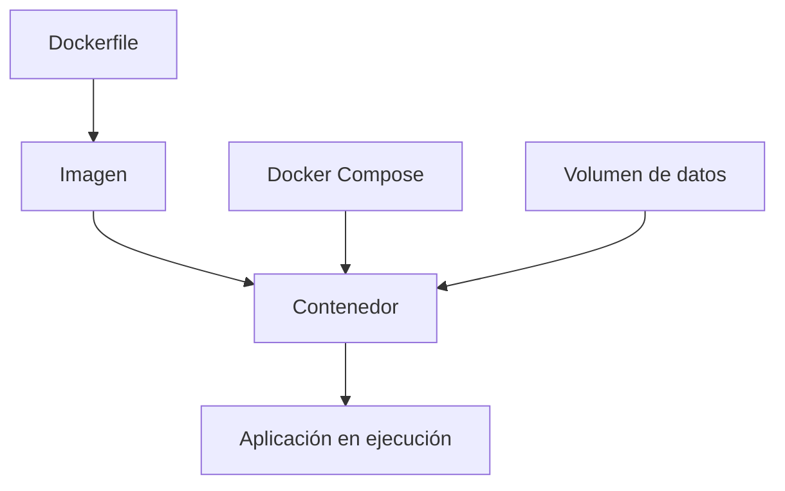

 Informe: Introducción a Docker

 ¿Qué es Docker?

**Docker** es una plataforma de código abierto que permite automatizar la implementación de aplicaciones dentro de **contenedores**.  
Un contenedor es una unidad ligera y portátil que incluye todo lo necesario para ejecutar una aplicación: código, dependencias, bibliotecas y configuraciones.

Docker facilita la creación de entornos de desarrollo consistentes y portátiles, eliminando el clásico problema de “funciona en mi máquina”.

---

Conceptos Clave

| Concepto | Descripción |
|-----------|--------------|
| **Imagen (Image)** | Plantilla inmutable que contiene el sistema operativo base y las dependencias necesarias para ejecutar una aplicación. |
| **Contenedor (Container)** | Instancia en ejecución de una imagen. Es un entorno aislado donde corre la aplicación. |
| **Dockerfile** | Archivo de texto que define los pasos para construir una imagen personalizada. |
| **Docker Hub** | Repositorio público (o privado) donde se almacenan y comparten imágenes de Docker. |
| **Docker Compose** | Herramienta que permite definir y ejecutar múltiples contenedores mediante un archivo `docker-compose.yml`. |
| **Volumen (Volume)** | Permite guardar datos fuera del contenedor, asegurando persistencia entre ejecuciones. |
| **Red (Network)** | Define cómo los contenedores se comunican entre sí y con el exterior. |

---

 Ventajas de Usar Docker

1. **Portabilidad:** los contenedores pueden ejecutarse en cualquier entorno (Windows, Linux, Mac).
2. **Aislamiento:** cada aplicación corre de forma independiente, sin interferir con otras.
3. **Escalabilidad:** fácil creación y eliminación de contenedores según la demanda.
4. **Velocidad:** las imágenes son ligeras y se inician en segundos.
5. **Estandarización:** los entornos son consistentes entre desarrollo, pruebas y producción.
6. **Integración CI/CD:** se adapta fácilmente a pipelines de integración continua y despliegue continuo.

---

 Desafíos y Limitaciones

- **Curva de aprendizaje:** entender bien imágenes, redes y volúmenes puede tomar tiempo.
- **Persistencia de datos:** si no se usan volúmenes, los datos se pierden al detener el contenedor.
- **Seguridad:** si las imágenes no son confiables, pueden incluir vulnerabilidades.
- **Sobrecarga inicial:** en proyectos pequeños, puede ser más complejo que útil.

---

Uso Práctico: Mini Proyecto con Docker

A continuación, un ejemplo práctico donde se ejecuta una aplicación web con **Python Flask** dentro de un contenedor.

 Estructura del proyecto

```
flask_app/
│
├── app.py
├── requirements.txt
└── Dockerfile
```

 Código de ejemplo

**app.py**
```python
from flask import Flask
app = Flask(__name__)

@app.route('/')
def home():
    return "¡Hola desde un contenedor Docker!"

if __name__ == '__main__':
    app.run(host='0.0.0.0', port=5000)
```

**requirements.txt**
```
flask
```

**Dockerfile**
```Dockerfile

FROM python:3.10-slim


WORKDIR /app


COPY . .


RUN pip install -r requirements.txt


EXPOSE 5000


CMD ["python", "app.py"]
```

 Comandos para ejecutar

```bash

docker build -t flask_app .


docker run -d -p 5000:5000 flask_app
```

Luego, abre en tu navegador:  
👉 [http://localhost:5000](http://localhost:5000)

---

 Extensión con Docker Compose

Podemos añadir una base de datos usando `docker-compose.yml`:

```yaml
version: '3'
services:
  web:
    build: .
    ports:
      - "5000:5000"
    depends_on:
      - db
  db:
    image: postgres:latest
    environment:
      POSTGRES_USER: admin
      POSTGRES_PASSWORD: secret
      POSTGRES_DB: mydb
```

Ejecutar todo el entorno:
```bash
docker-compose up -d
```

---

 Diagrama Conceptual



---

 Conclusiones

- Docker permite crear entornos ligeros, reproducibles y aislados.  
- Su uso agiliza el despliegue de aplicaciones y la colaboración entre equipos.  
- Aunque presenta retos iniciales, sus beneficios a nivel de productividad y consistencia lo convierten en una herramienta esencial en el desarrollo moderno.

---

 Referencias

- [Documentación oficial de Docker](https://docs.docker.com/)
- [Docker Hub](https://hub.docker.com/)
- [Guía Docker Compose](https://docs.docker.com/compose/)
- [Python Flask](https://flask.palletsprojects.com/)
